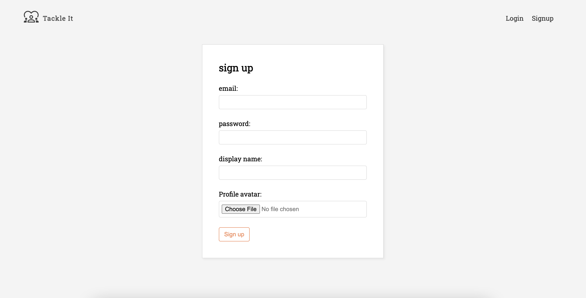
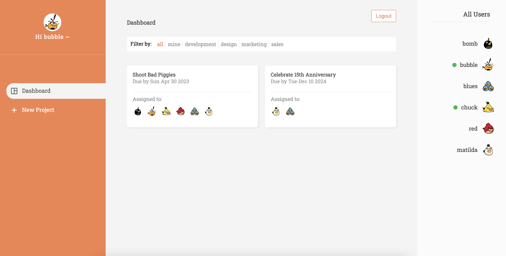
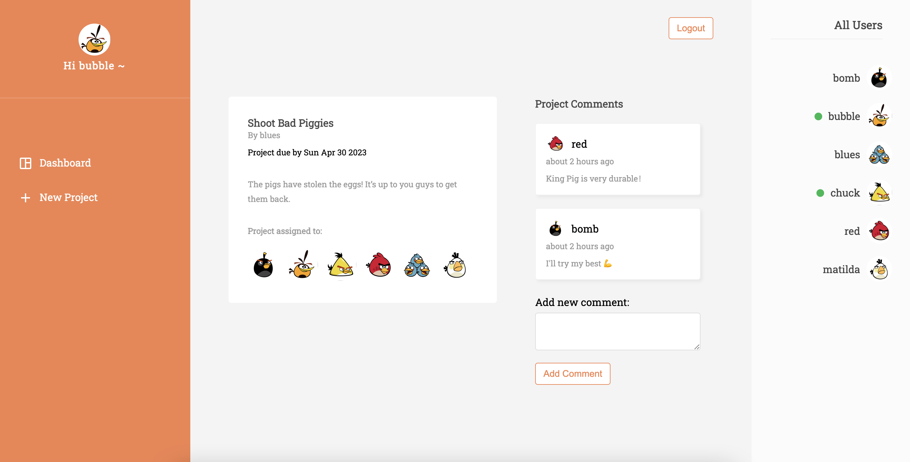
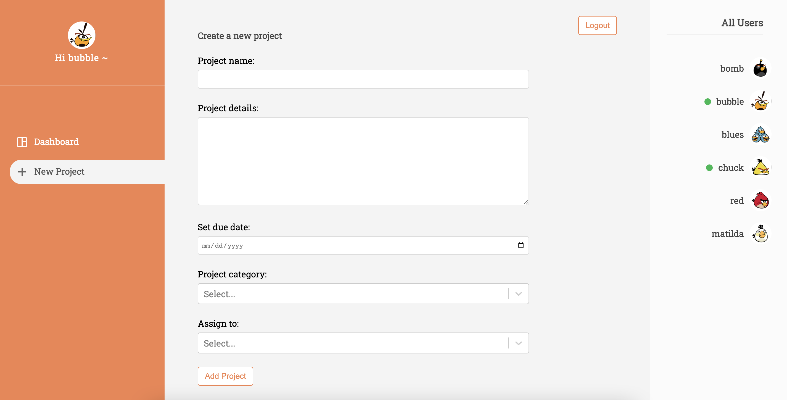

# Tackle It
A project management web app that provides a platform for users to collaborate on projects. 

## Highlights:
- Users can view & create projects, filter projects base on category/ownership, and leave comments 
- Used React (hooks, router, etc.) for front-end
- Used Firebase to implemented database, authentication & file uploads

### <a href="https://tackle-it-7.web.app/">click me!</a>